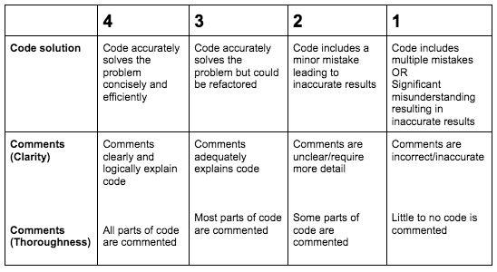

### List Lab Grading Schema

The grading for this assignment would be done based on accuracy of completion for each problem as well as comments to explain what each part of the code is doing. The code comments would be assessed based on clarity and thoroughness.  
 
The grading would be done using a 4 point rubric to assess each problem separately. Each problem would receive a total of 8 points. Up to 4 points would come from the code solution rubric score. The two rubric scores for the comments (clarity and thoroughness) would be averaged to make up the other 4 points. 

The scores out of 8 points for each problem would then be totaled into a final overall grade (Out of 64 total points). 

### Rubric

